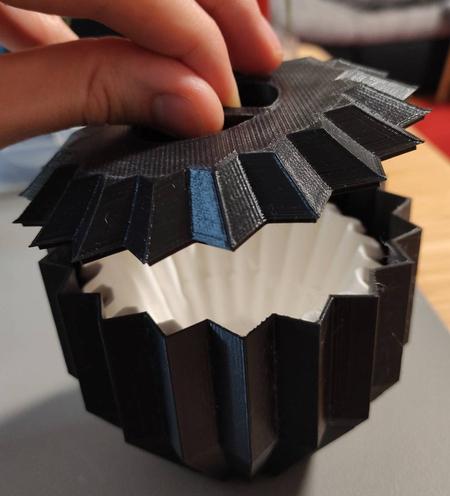

# Kalita Filter Container

A storage box for [Kalita Wave](http://kalita.ae/products/waveseries/) coffee filters inspired by the star-shaped [ORIGAMI Dripper](https://origami-kai.com/en/collections/dripper).
The lid keeps the filters dust-free and a hole in the bottom eases the removal of the filters.

## Files

Name | Description
---- | -----------
[Kalita-Filter-Container.scad](Kalita-Filter-Container.scad) | [OpenSCAD](http://openscad.org) design file
[Kalita-Filter-Container-Bottom.stl](Kalita-Filter-Container-Bottom.stl) | STL export of the bottom part
[Kalita-Filter-Container-Top.stl](Kalita-Filter-Container-Top.stl) | STL export of the top part (lid)

## Preview

## Printing

I printed the container on an [Anycubic i3 Mega](https://www.anycubic.com/products/anycubic-i3-mega) with black SUNLU PLA filament.
The print settings were: 0.2mm layer height and 20% infill.
The bottom took around 6 hours and 15 minutes to print, the top 4 hours and 20 minutes.

The lid of the container is best printed with the handle side on the printing bed.
The handle will be filled with support material that needs to be removed after printing.
